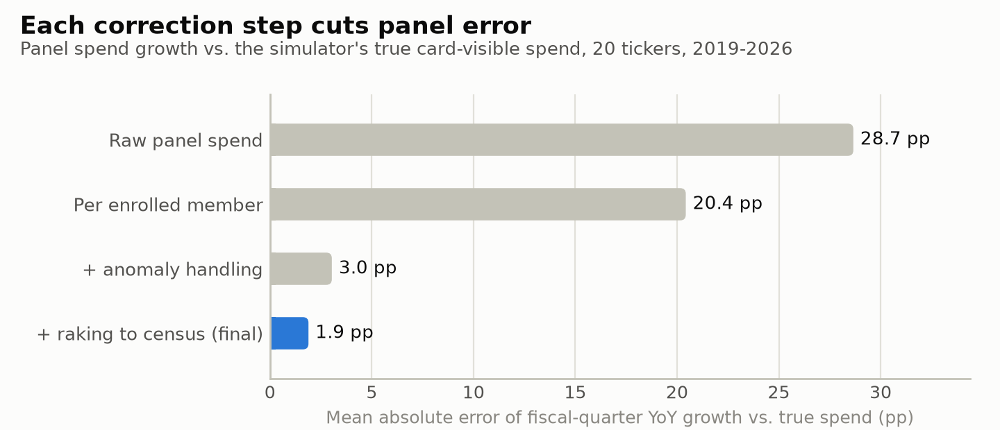
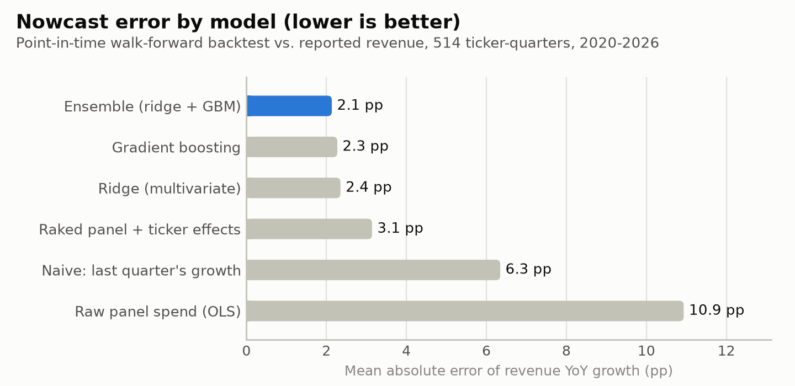
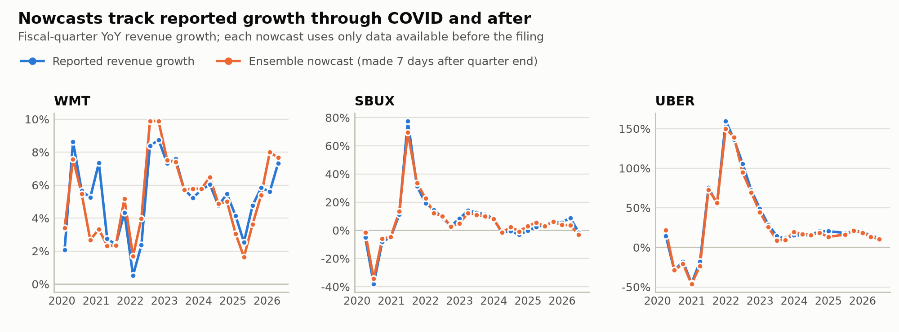
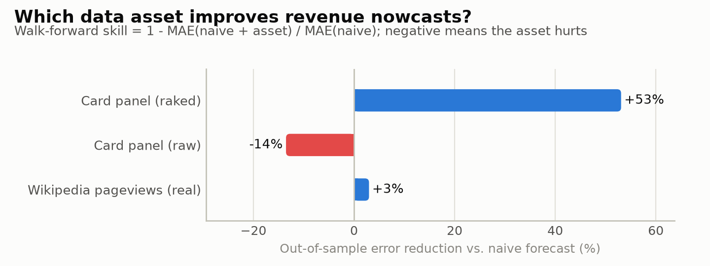
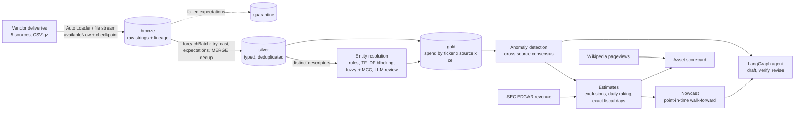

# PanelCast

**Alternative-data revenue nowcasting on a Spark / Delta Lake lakehouse.** Card-panel transactions go in; out come
merchant entity resolution, data-quality anomaly detection, panel-bias correction, point-in-time revenue nowcasts
scored against real SEC filings, an evaluation of a second (real) alt-data asset, and a LangGraph agent that writes
number-verified pre-earnings notes.

It rebuilds the core loop of an alternative-data research team end to end: ingest a vendor's daily deliveries,
work out which public company earned each dollar, catch the data problems that silently corrupt signals, correct a
panel that never looks like the population, and turn it into a revenue estimate about four weeks before the
company files its 10-Q, then measure whether it worked.

| Real public data | Simulated (real card data costs six figures) |
|---|---|
| Quarterly revenue for 20 companies from **SEC EDGAR XBRL**, as first reported, on each company's exact fiscal calendar (12-, 13-, 14-, 16- and 17-week quarters) | ~19M card transactions from 5 data contributors, with realistic merchant descriptors, MCCs, posting lags and demographics |
| Filing dates, so models only learn from numbers the market had already seen | Panel members joining, churning, and one source silently disappearing |
| Acquisition close dates (Habit -> YUM, Ruth's Chris and Chuy's -> DRI) | 13 injected data problems with a ground-truth log |
| Daily **English-Wikipedia pageviews** (evaluated as a second alt-data asset) | |

Simulated spend is anchored to each company's real revenue through a drifting "visibility ratio" the panel cannot
observe, so nowcasts are scored against reported revenue, not against the simulator. Because the simulator also
records the truth, every stage is measured, not just run. Details: [docs/METHODOLOGY.md](docs/METHODOLOGY.md).

## Results

Full run: 20,000 panelists, 19.4M transactions, 20 companies, 2018-2026, 6.7 minutes on a laptop (local Spark).

| What | Result |
|---|---|
| Revenue nowcast, ensemble vs. naive (514 ticker-quarters, 2020-2026) | **2.1 pp** vs. 6.3 pp mean absolute error in YoY growth; 2.1% revenue MAPE |
| ... during COVID (2020-21) | 2.6 pp vs. 13.6 pp |
| Timeliness | nowcast available a median **26 days** before the 10-Q/10-K |
| Beats naive / direction of acceleration / 80% band coverage | 71% of quarters / 83% / 78% |
| Entity resolution vs. ground truth (ticker level, dollar-weighted) | **100% precision**, 98.0% recall |
| Anomaly detection (outages, silent dropout, duplicates, unit errors, descriptor breaks) | **13 / 13** detected, 0 false positives, median delay 0 days |
| Malformed rows quarantined / duplicate deliveries removed | 3,781 of 3,781 / 10,908 |
| Panel YoY error vs. true spend: raw -> per member -> + anomaly handling -> + raking | 28.7 -> 20.4 -> 3.0 -> **1.9 pp** |
| Real Wikipedia pageviews as an alt-data asset | +3% skill vs. naive: weak (attention is not revenue) |

<picture>
  <source media="(prefers-color-scheme: dark)" srcset="reports/figures/panel_accuracy_dark.png">
  
</picture>

<picture>
  <source media="(prefers-color-scheme: dark)" srcset="reports/figures/nowcast_mae_dark.png">
  
</picture>

<picture>
  <source media="(prefers-color-scheme: dark)" srcset="reports/figures/nowcast_timeseries_dark.png">
  
</picture>

<picture>
  <source media="(prefers-color-scheme: dark)" srcset="reports/figures/asset_skill_dark.png">
  
</picture>

Every table: [reports/RESULTS.md](reports/RESULTS.md). Example agent output: [reports/notes/TGT.md](reports/notes/TGT.md).

## Architecture



| Stage | What it does | Main tools |
|---|---|---|
| `simulate` | Builds the vendor feed: real revenue -> daily spend (PCHIP on cumulative revenue), 36 demographic cells, 5 sources, descriptor noise, injected problems | pandas/NumPy, Spark `mapInPandas` |
| `reference` | Real revenue, pageviews, brands with effective-dated ownership, census margins | pandas, Delta |
| `bronze` | Incremental, exactly-once ingestion of every delivery as strings, with file lineage | Auto Loader / Structured Streaming |
| `silver` | ANSI-safe parsing, 9 expectations -> quarantine, dedup, descriptor normalization | `foreachBatch`, `MERGE`, Spark SQL |
| `resolve` | Descriptor -> brand: merchant-of-record rules, TF-IDF blocking, fuzzy + MCC scoring, optional Claude review | scikit-learn, RapidFuzz, LangChain |
| `gold` | Daily membership and ticker-tagged spend by source and demographic cell | Spark SQL, broadcast joins |
| `anomalies` | Robust z-scores vs. cross-source consensus; quasi-Poisson tagging-break test | `applyInPandas` |
| `estimates` | Exclusions, unit-error rescaling, daily raking (IPF), fiscal-quarter roll-up | `applyInPandas`, pandas |
| `nowcast` | Point-in-time walk-forward: naive, OLS, ridge, gradient boosting, ensemble, 80% bands | scikit-learn |
| `assets` | Scorecard for each alt-data asset: coverage, fit, out-of-sample skill, timeliness, quality | scikit-learn |
| `evaluate` | Every stage vs. ground truth | Spark, pandas |
| `agent` | Pre-earnings notes with point-in-time tools and a deterministic number checker | LangGraph, Claude |
| `report` | `reports/RESULTS.md` and the figures above | matplotlib |

## Quickstart

**Requirements:** Python 3.11+, Java 17 (Spark). Nothing else; on Windows no `winutils.exe` is needed (see below).

```bash
python -m venv .venv
```

```bash
.venv\Scripts\activate
```

(macOS/Linux: `source .venv/bin/activate`)

```bash
pip install -e ".[local,dev]"
```

```bash
panelcast run all --scale 0.5
```

That runs every stage on a 5,000-member panel (~5M transactions, ~4 minutes); drop `--scale` for the 10,000-member
default, or use `--scale 2` to reproduce the results above. Run single stages with e.g. `panelcast run silver resolve`.
Outputs: Delta tables under `lakehouse/`, reports under `reports/`.

Optional extras:

* `ANTHROPIC_API_KEY` turns on Claude review of gray-zone descriptors and LLM-written research notes.
* `panelcast fetch-reference` re-downloads EDGAR and Wikipedia data (set `SEC_USER_AGENT="Your Name you@email.com"`,
  as the SEC asks of automated clients). The fetched files are committed, so the pipeline runs offline.
* Databricks Free Edition: [docs/DATABRICKS.md](docs/DATABRICKS.md) (Git-folder notebook, or a 13-task serverless
  job from the bundle in `databricks.yml`).
* GitHub Codespaces / VS Code dev container: `.devcontainer/` has Python 3.12 + Java 17.

**Spark on Windows without winutils.** Hadoop shells out to `winutils.exe` for file permissions. `panelcast.spark`
avoids every such code path instead: Delta jars go on the driver classpath (Maven Central, SHA-1 verified), the
local filesystem is GlobalMentor's pure-Java `BareLocalFileSystem`, and Delta's log store and Streaming's checkpoint
manager use FileSystem-API implementations. It also finds a freshly installed JDK and works around hostnames with
underscores, which Spark rejects.

## Tests

```bash
pytest -m "not e2e"
```

```bash
pytest -m e2e
```

56 unit and Spark tests (normalization parity between Python and Spark, matcher edge cases, EDGAR fiscal logic,
raking, detectors, point-in-time walk-forward, the agent's tool/verify/revise loop driven by a scripted fake LLM)
plus an end-to-end test that runs every stage on a toy panel and checks reconciliation, idempotent re-ingestion
and quality thresholds against ground truth. CI: `.github/workflows/ci.yml`.

## Project layout

```
conf/            panelcast.yaml (runtime), universe.yaml (real reference data), simulation.yaml (synthetic world)
data/reference/  committed real data: EDGAR revenue, Wikipedia pageviews
src/panelcast/   simulate/ pipeline/ entity_resolution/ anomaly/ stats/ modeling/ agent/ reference/
tests/           unit, Spark, and end-to-end tests
notebooks/       Databricks walkthrough notebook
resources/       Databricks job definition (bundle)
docs/            METHODOLOGY.md, DATABRICKS.md, INTERVIEW_GUIDE.md
reports/         generated results, figures, research notes
```

## Limitations

* Card transactions are simulated. The methodology is validated against known truth and nowcasts against real
  revenue, but absolute accuracy reflects the simulator's noise settings; a real vendor feed would need hand-labeled
  descriptors to evaluate entity resolution.
* The panel is small (10-20K members vs. millions in production), so small tickers (Ulta, Chewy, Best Buy) are noisy.
* The LLM paths are covered by tests with a scripted model; the shipped notes were produced by the deterministic
  template because no API key was used to generate this repo's outputs.
* The Databricks bundle follows the documented spec but has not been deployed from this repo yet.
